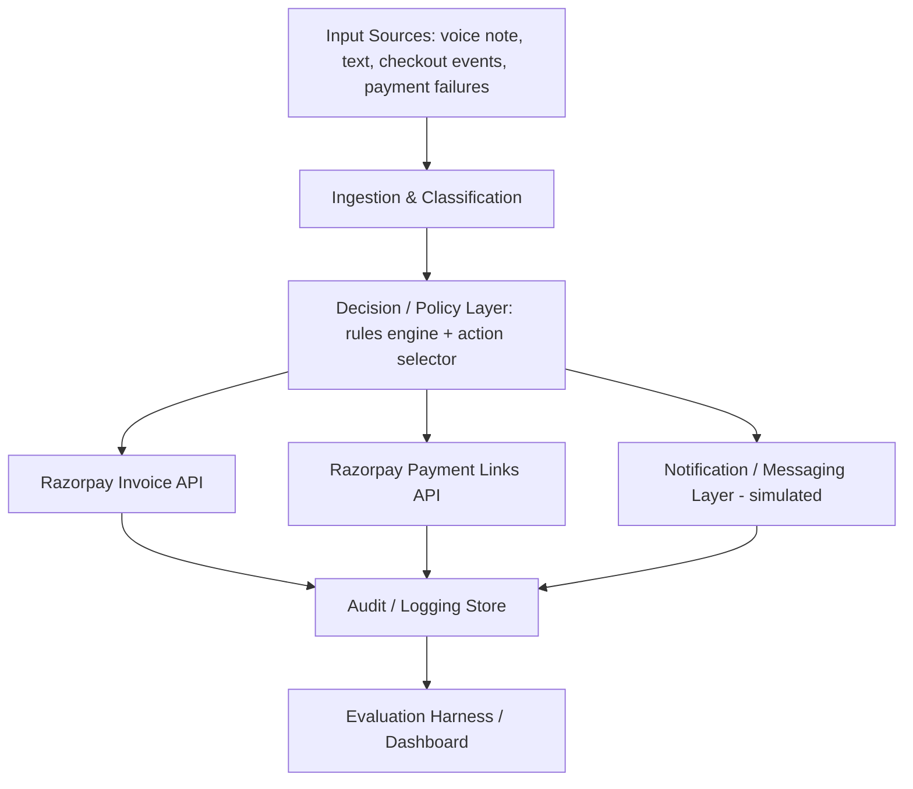
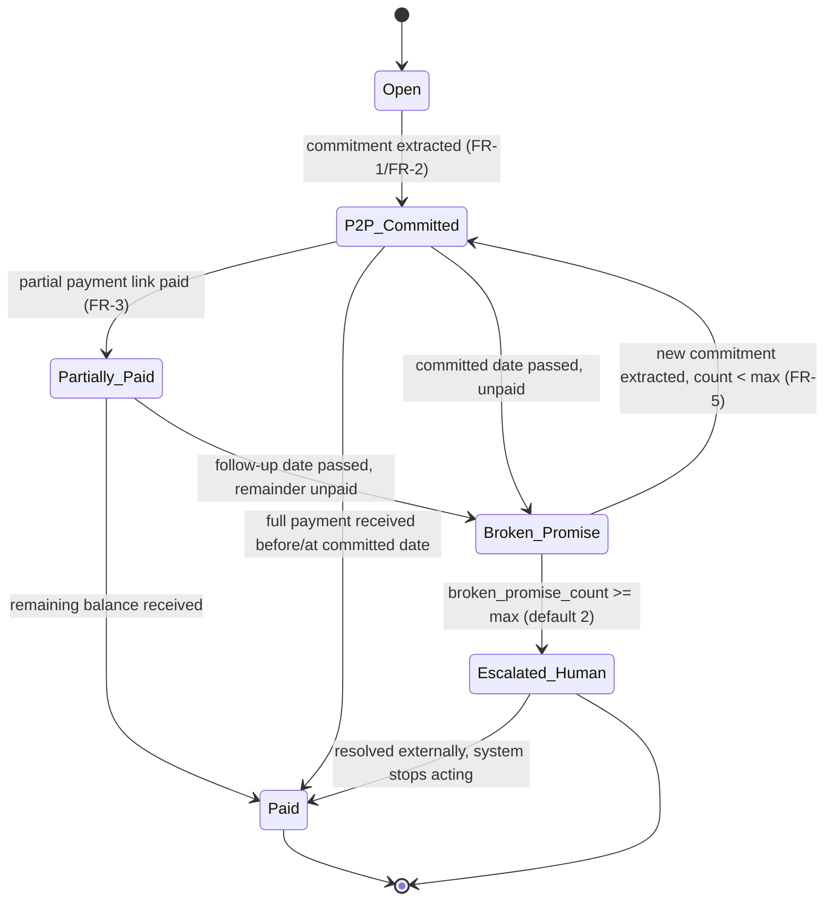
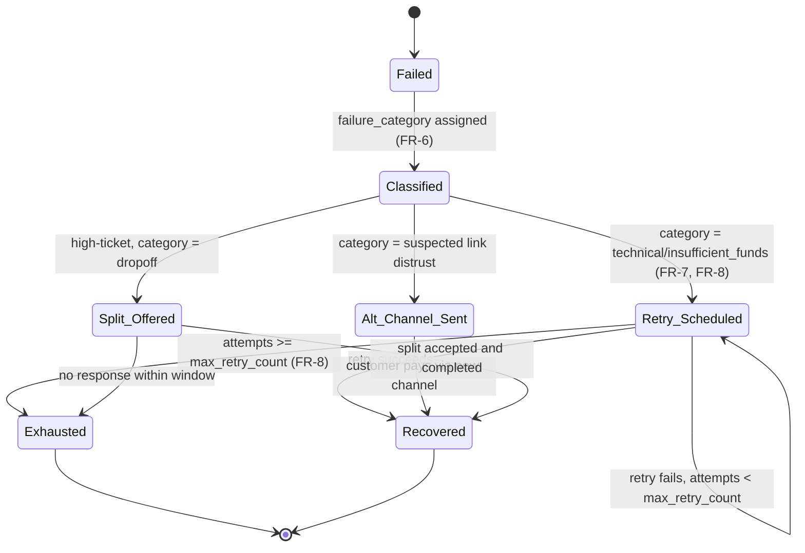

# Project Specification: AI Revenue Recovery Agent

**Document Info**
| Field | Value |
|---|---|
| Version | 0.2 |
| Date | 2026-08-22 |
| Status | Draft |
| Purpose | Define scope, requirements, and architecture for a hackathon submission to Razorpay's "AI Revenue Recovery" track, for use by the build team and judges. |
| Changelog | v0.2: added formal state machines, idempotency/concurrency handling, cost-weighted evaluation methodology, event-driven architecture rationale, guardrail testing strategy, and an explicit "why this is not a thin LLM wrapper" framing (§6.7) — see rationale inline. |

### Design Philosophy (read this first)

Most submissions to this track will be an LLM prompted to sound like a collections agent, wired to one or two API calls, evaluated on a handful of hand-picked examples. That is a demo, not a system. This spec is written to produce the latter: every component that touches money or customer trust is deterministic and testable; the LLM is scoped narrowly to *language understanding and generation*, never to *policy decisions*. If a judge asks "what happens if this races, retries twice, or gets an adversarial input," this document should already have the answer, not require the team to improvise one on stage.

---

## 1. Project Overview

### 1.1 Name / Working Title
**Vasooli** *(working name — flagged for reconsideration, see Open Questions §11.1)* — an AI Revenue Recovery agent for Razorpay merchants.

### 1.2 One-Sentence Summary
An agent that detects revenue at risk across three failure modes — B2B receivable non-payment, checkout abandonment, and payment/routing degradation — diagnoses the likely cause, and executes a bounded, auditable recovery workflow that speaks the customer's language (including Hinglish and India-specific payment behavior) rather than a generic dunning notice.

### 1.3 Problem Statement / Motivation
Revenue loss on Razorpay-powered merchants rarely happens in one clean step. It happens through a chain: a payment degrades due to a bank-side or routing issue, a checkout is abandoned mid-flow, a subscription mandate fails, or a B2B invoice ages past due with an informal (often WhatsApp voice note) promise attached to it. Today this chain is handled either manually (a human collections effort) or with rigid, non-adaptive rules (fixed-interval retries, generic SMS reminders) that ignore real Indian payment behavior: salary-cycle liquidity, bank peak-hour outages, distrust of cold SMS payment links, and business conducted over informal voice/text commitments rather than formal terms.

The opportunity is to close the full loop — detect, diagnose root cause, choose the right bounded intervention, execute it, and track the outcome — with a system that understands *why* Indian payments fail, not just *that* they failed.

### 1.4 Goals & Success Metrics

| Goal | Metric (formula in §6.10) | Target for Demo |
|---|---|---|
| Recover B2B receivables faster / more completely | Recovery Rate + Lift over naive-baseline + DSO reduction, on a **held-out** synthetic invoice batch | Positive, honestly-reported Lift on 40–50+ held-out invoices; DSO reduction stated in days |
| Recover abandoned/degraded checkout revenue | Recovery Rate + Lift over naive baseline, on a held-out checkout/payment-failure batch | Positive, honestly-reported Lift on the same batch size |
| Model tradeoffs correctly, not just "get it right" | Cost-Weighted Error Rate (§6.10) | Reported and defensible, even if not minimized to zero — judges should see the tradeoff was considered, not hidden |
| Demonstrate safe autonomy | 100% of money-affecting actions traceable to a logged rule or decision; guardrail unit tests (§6.9) passing | Full audit trail inspectable live + green test suite shown, not just claimed |
| Demonstrate graceful failure handling | Idempotency and race-condition tests (§6.9) passing; ≥1 staged failure/edge case handled live | Guardrail-denial scenario + a deliberately duplicated webhook event shown handled correctly |
| Judge scoring alignment | Recovery Rate, Lift, and exception list reported on a genuine held-out set (thresholds not tuned on it) | Batch-level table with train/test separation stated explicitly |

---

## 2. Scope

### 2.1 In-Scope Features / Capabilities

**Primary flow — B2B Receivables / Promise-to-Pay Tracker (headline demo)**
- Ingest an informal payment commitment (simulated WhatsApp voice note or text) from a B2B buyer.
- Transcribe/parse the message to extract structured intent: amount, split (if partial), and committed date.
- Update the corresponding Razorpay Invoice status to reflect the extracted promise ("P2P Committed").
- Generate a Razorpay Payment Link (test mode) for any immediately-agreed partial payment.
- Schedule an automated follow-up trigger for the remaining balance on the committed date.
- Escalate through a defined ladder (reminder → firmer reminder → human handoff) if a promise is broken, with a hard stop after a configured number of broken promises.

**Secondary flow — Checkout Abandonment / Payment Degradation Recovery**
- Monitor a synthetic stream of checkout sessions and payment attempts for abandonment or failure.
- Classify failure type where possible (e.g., "technical decline" during a known bank peak-hour window vs. "insufficient funds" vs. generic drop-off).
- Select and execute a bounded recovery action appropriate to the classified cause (timed silent retry, salary-date-deferred retry, verified WhatsApp-style resend with in-app QR, or split-payment offer for high-ticket B2B-style checkouts).
- Respect a defined retry cap and timing policy rather than naive fixed-interval retries.

**Tertiary flow — Subscription / Mandate Retry (minor, secondary priority)**
- Basic smarter-than-naive retry scheduling for a failed UPI Autopay / e-mandate (e.g., defer to salary-cycle date instead of blind 24-hour retry).
- Explicitly scoped as a minor demo beat, not a headline flow (see Conversation Decision Log, §11.5).

**Cross-cutting capabilities**
- Policy-based guardrails: hard-coded caps on discount %, retry counts, and escalation steps that the agent cannot exceed regardless of model output.
- Full audit trail: every money-affecting or customer-facing action logged with the triggering input, the rule/decision applied, and the outcome.
- Batch evaluation harness: run all flows across a synthetic batch (target 40–50+ records per flow) and report recovery rate / match outcomes against a naive baseline.
- A staged "policy breach" demo scenario: a user requests an out-of-policy discount (e.g., 80%) and the system denies it and offers an approved alternative (e.g., 3-month split).

### 2.2 Explicitly Out-of-Scope Items
- **Live production WhatsApp Business API integration.** Voice-note/chat input will be simulated (pre-recorded audio or scripted text fed into the pipeline), not a live Meta WhatsApp Business API integration, due to template-approval and session-window constraints incompatible with a hackathon timeline.
- **Real bank/NPCI connectivity.** All bank-failure, peak-hour-downtime, and mandate-retry behavior is modeled against synthetic data and documented assumptions about NPCI/e-mandate retry norms — not a live integration with any bank or NPCI system.
- **Production-grade collections compliance/legal review.** The escalation ladder and tone will be designed to be plausible and compliant in spirit, but this spec does not constitute or replace legal review of actual collections conduct rules in India.
- **Full multi-language support beyond Hindi-English (Hinglish) code-mixing.** Other Indian languages are out of scope for the hackathon build.
- **General-purpose CRM or invoicing product.** This is a recovery agent layered on top of Razorpay's existing invoicing/payment primitives, not a replacement for them.
- **Fraud/risk scoring of the failing customer.** Distinguishing "genuinely can't pay" from "fraudulently avoiding payment" is out of scope (would belong to the AI Risk Manager track); this project assumes good-faith non-payment/failure unless explicitly flagged otherwise by a human.

### 2.3 Assumptions & Constraints
- Build window: hackathon timeframe (approx. 48–72 hours build + prep), referenced in this document as the primary constraint on scope.
- All payment actions will run against **Razorpay test-mode APIs** only — no real money movement.
- The team has **no confirmed production access** to live WhatsApp Business API, live bank rails, or live NPCI systems; all such integrations are simulated (flagged as an assumption, not a confirmed constraint — see Open Questions §11.2).
- Synthetic datasets will be generated by the team to represent invoices, checkout sessions, payment failures, and promise-to-pay conversations; no real merchant or customer data will be used.
- Hindi-English (Hinglish) transcription is assumed feasible via an existing speech-to-text service or model with acceptable accuracy on code-mixed audio; this is flagged as a technical risk (see §10).
- NPCI/e-mandate retry limit specifics are assumed from general industry knowledge and will be approximated in policy config rather than sourced from an authoritative current spec within the hackathon window (flagged in Open Questions §11.3).

---

## 3. Target Users & Personas

| Persona | Description | Primary Need |
|---|---|---|
| **Ramesh — B2C subscriber** | Pays a monthly coaching/gym/SaaS fee via UPI Autopay; income is salary-cycle dependent; not trying to churn, just cash-constrained mid-month or affected by bank downtime. | Wants flexible, low-friction retry timing and clear, non-alarming communication. |
| **Distributor/Wholesaler buyer ("Bhaiya")** | B2B buyer who communicates payment status informally over WhatsApp voice notes rather than formal terms; genuinely intends to pay but on his own timeline. | Wants a low-friction way to commit to a date/amount without navigating a formal portal. |
| **Merchant / Finance Owner (end customer of this product)** | SME or D2C merchant using Razorpay who is losing revenue passively to failed payments, drop-offs, and slow-paying B2B customers, with no dedicated recovery tooling. | Wants recovered revenue, visibility into what's being recovered and how, and confidence the automation won't damage customer relationships or violate policy. |
| **Hackathon Judge (Razorpay team)** | Evaluates submissions against the stated track bar: measured recovery, compliant escalation, stopping rules, audit trail. | Wants to see a real batch result, an honest baseline comparison, and evidence of bounded/auditable autonomy — not a single polished anecdote. |

---

## 4. Functional Requirements

Priority key: **M** = Must have, **S** = Should have, **C** = Could have.

| # | Requirement | Priority | Notes / User Story |
|---|---|---|---|
| FR-1 | System shall ingest a simulated informal payment commitment (text or pre-recorded audio) and extract: committed amount, payment split (if any), and committed date. | M | *As a merchant, I want my buyer's WhatsApp voice note automatically converted into a tracked commitment so I don't have to listen and log it manually.* |
| FR-2 | System shall update a corresponding Razorpay Invoice's status to reflect an extracted promise-to-pay (e.g., "P2P Committed", with amount and date). | M | Direct API interaction with Razorpay Invoicing (test mode). |
| FR-3 | System shall generate a Razorpay Payment Link (test mode) for any immediately-agreed partial payment amount extracted from a commitment. | M | e.g., 50% now via generated link, 50% deferred. |
| FR-4 | System shall schedule an automated follow-up action for the remaining/committed balance on the extracted commitment date. | M | Time-based trigger, not manual. |
| FR-5 | System shall escalate through a defined ladder (friendly reminder → firm reminder → human handoff) if a promise is broken, and shall stop escalating automatically after a configured number of broken promises (default: 2). | M | Stopping rule explicitly required by track bar. |
| FR-6 | System shall classify incoming payment failures/checkout abandonments into at least these categories where signal supports it: technical/bank-side decline, insufficient funds, checkout drop-off (no attempt), other. | M | Classification drives which recovery action is selected. |
| FR-7 | System shall select a recovery action appropriate to the classified failure category (e.g., silent retry next morning for technical decline during a known bank peak-hour window; deferred retry to salary date for insufficient funds; verified resend with in-app QR for suspected SMS-link distrust; split-payment offer for high-ticket drop-off). | M | Core "diagnosis → intervention" loop required by the track. |
| FR-8 | System shall enforce a configurable maximum retry count and minimum retry spacing for any single failed payment/mandate, independent of model output. | M | Must reflect a realistic approximation of e-mandate retry norms (see Open Question §11.3). |
| FR-9 | System shall enforce a configurable maximum discount/concession percentage that cannot be exceeded by any generated offer, regardless of what a customer requests or what the language model proposes. | M | This is the "guardrail denial" scenario used in the live demo. |
| FR-10 | When a customer requests a concession beyond the configured maximum, the system shall deny the out-of-policy request and offer a pre-approved alternative (e.g., a 3-month split plan) instead of failing silently or complying. | M | Core "standout" demo moment. |
| FR-11 | System shall log every money-affecting or customer-facing action with: timestamp, triggering input, rule/decision applied, and outcome, in a human-inspectable audit trail. | M | Required for judge review; must be viewable, not just claimed. |
| FR-12 | System shall be evaluable against a **held-out** synthetic batch (target: 40–50+ records per primary flow) that was not used to tune any policy threshold, and shall report Recovery Rate, Lift over naive baseline, and Cost-Weighted Error Rate per §6.10. | M | Directly satisfies the stated track bar; the held-out/dev split is what elevates this above a hackathon-typical "tuned and tested on the same data" mistake. |
| FR-13 | System shall produce an explicit, itemized list of cases it could not resolve/recover within the batch evaluation, with a stated reason per case, rather than omitting them. | M | Honesty requirement; mirrors Finance Controller track's "honest exception list" principle applied here. |
| FR-19 | System shall handle duplicate webhook delivery and scheduler/payment race conditions correctly, implemented as a unique constraint on `razorpay_event_id` (not a standalone idempotency service) plus a confirm-then-act check on scheduled actions, per §6.7, covered by automated tests per §6.9. | M | This is a deliberate skill-signaling requirement — most hackathon submissions never consider this. Kept deliberately lightweight to implement (a DB constraint, not new infrastructure). |
| FR-20 | The Policy Engine (discount cap, retry cap, escalation stop) shall be implemented as pure, deterministic functions independent of any LLM call, and shall be covered by the unit tests listed in §6.9. | M | Structural guarantee that guardrails cannot be silently bypassed by model behavior; testable independent of the demo. |
| FR-14 | System shall support a smarter-than-naive subscription/mandate retry scheduling policy (e.g., defer retry to a salary-cycle-aware date rather than blind 24-hour intervals). | S | Secondary/minor flow per scope decision. |
| FR-15 | System shall support Hindi-English (Hinglish) code-mixed natural language for both parsing incoming commitments and generating outgoing messages. | S | Key differentiator; degrade gracefully to English-only if ASR accuracy is insufficient during build. |
| FR-16 | System should provide a simple dashboard/summary view showing: total at-risk revenue detected, amount recovered, recovery rate by flow, and outstanding exceptions. | S | Primary artifact for judge review of FR-12/FR-13. |
| FR-17 | System could simulate a live voice-note interaction end-to-end during the demo (audio in → transcription → extraction → action), with a pre-recorded fallback available if live transcription underperforms. | C | Risk-mitigated "nice to have" for demo impact. |
| FR-18 | System could extend the failure-classification/recovery-selection loop to a live or semi-live payment-degradation monitoring view (success-rate-by-segment trend). | C | Stretch goal if time permits after M/S items are complete. |

---

## 5. Non-Functional Requirements

| Category | Requirement |
|---|---|
| **Performance** | Batch evaluation (40–50+ records) must complete within a demo-reasonable time (target: under 2 minutes) so it can be run live if desired. |
| **Scalability** | Not a hard requirement for the hackathon build, but architecture should not preclude scaling to a larger record count (i.e., avoid designs that only work with hardcoded small batches). |
| **Reliability** | Every simulated external action (payment link generation, invoice status update) must handle and log failure gracefully — no unhandled exceptions during a live demo path. |
| **Security** | No real payment credentials, real customer PII, or real merchant data used anywhere in the build; all data synthetic. Test-mode API keys only. |
| **Auditability** | All decisions must be logged in a structured, queryable format (not just console output) — see FR-11. |
| **Compliance-mindedness** | Escalation tone and frequency must reflect a plausible, non-harassing collections ladder (capped attempts, defined stopping point) even though full legal compliance review is out of scope (§2.2). |
| **Accessibility** | Any demo UI should be legible and usable via keyboard/screen-reader-basic standards; not a primary focus given hackathon scope, but should not actively violate basic accessibility (color contrast, alt text on key visuals). |
| **Transparency to judges** | Any simulated component (WhatsApp, bank rails, NPCI) must be clearly labeled as simulated in both the live demo and any submitted materials — no implied claims of live integration that don't exist (see §2.2). |
| **Determinism where it matters** | Guardrail checks (discount caps, retry caps, escalation stop) must be implemented as deterministic rule checks, not LLM judgment calls, so they cannot be inadvertently bypassed by model behavior. |

---

## 6. Technical Architecture

### 6.1 High-Level Architecture (text-based)

```
                         ┌─────────────────────────────┐
                         │   Input Sources (simulated)  │
                         │  - Voice note / text (P2P)   │
                         │  - Checkout event stream     │
                         │  - Payment/mandate failures  │
                         └───────────────┬──────────────┘
                                         │
                         ┌───────────────▼──────────────┐
                         │   Ingestion & Classification   │
                         │  - ASR / text parsing (Hinglish)│
                         │  - Failure-type classifier      │
                         │  - Intent/commitment extractor  │
                         └───────────────┬──────────────┘
                                         │
                         ┌───────────────▼──────────────┐
                         │      Decision / Policy Layer    │
                         │  - Deterministic rules engine    │
                         │    (retry caps, discount caps,   │
                         │     escalation ladder, stop rule)│
                         │  - Action selector (per flow)    │
                         └───────────────┬──────────────┘
                                         │
                    ┌────────────────────┼─────────────────────┐
                    │                    │                      │
          ┌─────────▼────────┐ ┌─────────▼────────┐  ┌─────────▼────────┐
          │ Razorpay Invoice   │ │ Razorpay Payment  │  │ Notification /   │
          │ API (test mode)    │ │ Links API (test)  │  │ Messaging layer   │
          │ - status update    │ │ - link generation │  │ (simulated WA /   │
          └─────────┬────────┘ └─────────┬────────┘  │  SMS / voice out) │
                    │                    │            └─────────┬────────┘
                    └────────────────────┼──────────────────────┘
                                         │
                         ┌───────────────▼──────────────┐
                         │        Audit / Logging Store    │
                         │  - every action + trigger +      │
                         │    rule applied + outcome        │
                         └───────────────┬──────────────┘
                                         │
                         ┌───────────────▼──────────────┐
                         │   Evaluation Harness / Dashboard │
                         │  - batch runner (40–50+ records) │
                         │  - recovery rate vs. baseline     │
                         │  - exception list                 │
                         └────────────────────────────────┘
```

### 6.2 Mermaid Diagram (equivalent, for tooling that renders it)



### 6.3 Key Components / Modules

| Component | Responsibility |
|---|---|
| **Ingestion & Extraction Module** | Converts raw input (audio or text) into structured commitment data (amount, split, date) or failure event data. |
| **Failure Classifier** | Labels a payment failure/checkout event by likely cause (technical/bank-side, insufficient funds, drop-off, other). |
| **Policy / Rules Engine** | Deterministic, hard-coded checks: max discount %, max retry count, retry timing windows, escalation step limits. This is the guardrail layer and must be separate from any LLM component. |
| **Action Selector / Orchestrator** | Given a classified event and policy constraints, selects and sequences the appropriate recovery action(s); the "agent loop." Owns a simple in-memory delayed-job check (a heap/list keyed by trigger time, polled on a loop) for scheduled follow-ups and retries — deliberately not a standalone scheduling service; this is sufficient to prove the confirm-then-act pattern without separate infrastructure. |
| **Razorpay API Adapter** | Wraps calls to Razorpay Invoicing API and Payment Links API (test mode). Enforces idempotency via a unique constraint on `razorpay_event_id` in the events table — not a standalone idempotency store; a duplicate insert fails fast and is caught as a no-op. |
| **Messaging Simulator** | Simulates outbound WhatsApp/SMS/voice messaging (since live WhatsApp Business API is out of scope); should be built so a real integration could be swapped in later with minimal change. |
| **Audit Log Store** | Structured, queryable store of every action taken, its trigger, and its outcome. |
| **Evaluation Harness** | Runs the full pipeline against a synthetic batch and computes recovery rate / match outcomes vs. a naive baseline; produces the exception list. |
| **Dashboard / Demo UI** | Presents live and batch results to a human (merchant view + judge-facing summary view). |

### 6.4 Data Model / Schema Outline

**Invoice**
```
invoice_id, merchant_id, buyer_id, amount, currency,
due_date, status (Open | P2P_Committed | Partially_Paid | Paid | Overdue | Escalated),
p2p_committed_amount, p2p_committed_date, escalation_step, broken_promise_count
```

**PaymentEvent**
```
event_id, transaction_id, merchant_id, customer_id, amount,
status (Success | Failed | Abandoned), failure_code, failure_category
(technical | insufficient_funds | dropoff | other), timestamp, channel (UPI | card | netbanking)
```

**RecoveryAction**
```
action_id, related_event_id (FK to Invoice or PaymentEvent), action_type
(retry | payment_link | reminder | escalation | denial_and_alternative),
scheduled_time, executed_time, outcome (recovered | pending | failed | escalated),
policy_rule_applied
```

**AuditLogEntry**
```
log_id, timestamp, actor (system | rule_engine | model), trigger_input,
decision, rule_or_model_reference, resulting_action_id, outcome
```

**PolicyConfig**
```
max_discount_pct, max_retry_count, min_retry_spacing_hours,
salary_cycle_dates, bank_peak_hour_windows, max_broken_promises_before_escalation
```

### 6.5 Tech Stack Recommendations

| Layer | Recommendation | Justification |
|---|---|---|
| Backend / orchestration | Python (FastAPI or similar lightweight framework) | Fast to build, strong ecosystem for both API integration and light ML/rules logic; team likely has existing familiarity. |
| LLM / extraction layer | A hosted LLM API for intent/commitment extraction and Hinglish message drafting | Use structured-output prompting (JSON schema) so extraction results are directly consumable by the deterministic rules engine — do not let the LLM perform the guardrail checks itself. |
| Speech-to-text | **Sarvam AI (Saaras v3)** — purpose-built for Hindi/Hinglish code-mixed accuracy; pilot on real recorded samples Day 1 using free signup credits, lock go/no-go by end of Day 1. **Fallback: self-hosted Whisper** (zero-cost) if accuracy or credit limits become a problem mid-week. | Building custom ASR is out of scope for the timeline; Sarvam benchmarks ahead of Whisper/Gemini/Deepgram specifically on Indian-language accuracy, which is the exact axis this project's differentiation depends on. |
| Rules engine | Plain deterministic code (not a rules-engine framework) given scope size | Avoids unnecessary complexity; a rules framework is overkill for a hackathon-scale policy set. |
| Data storage | SQLite or a simple JSON-file-backed store for the hackathon build | Sufficient for a 40–50+ record batch; avoids infra overhead of a full database for a time-boxed build. |
| Payment integration | Razorpay test-mode APIs (Invoicing, Payment Links) via official SDK | Directly required by the track; official SDK reduces integration risk. |
| Dashboard/UI | A lightweight web frontend (e.g., a simple React or server-rendered page) | Needs to be demoable and legible to judges, not production-polished. |
| Audit log | Structured log table/collection, queryable and exportable to a simple viewer | Must be genuinely inspectable live, not just claimed. |

### 6.6 APIs / Integrations

| API / Integration | Purpose | Mode |
|---|---|---|
| Razorpay Invoicing API | Create/update invoice status, reflect P2P commitments | Test mode |
| Razorpay Payment Links API | Generate partial/split payment links | Test mode |
| Razorpay Webhooks (`payment.failed`, `payment.captured`, `invoice.paid`, `invoice.expired`) | Event source for the recovery pipeline — see §6.7 for why this is webhook-driven rather than polling | Test mode |
| Hosted LLM API | Commitment extraction (structured output only), failure-cause narration, Hinglish message drafting | Structured-output calls only for extraction; the LLM never sets policy values (see §6.8) |
| ASR / Speech-to-text service | Transcribe simulated voice notes | To be selected (Open Question §11.4) |
| Messaging simulator (internal) | Stand-in for WhatsApp/SMS output | Fully internal/simulated for hackathon |

### 6.7 Why Event-Driven, Not Polling — and Why This Isn't a Thin LLM Wrapper

**Event-driven, not polling.** A naive implementation polls Razorpay's invoice/payment status on a timer and reacts to changes it sees. This is simple but has two real problems that a judge with systems experience will probe: (1) it introduces detection latency bounded by poll interval, which directly delays recovery action — the exact thing this product is supposed to minimize; (2) it doesn't scale — polling N merchants' invoices on a timer is O(N) load regardless of whether anything changed. This system instead subscribes to Razorpay webhooks (`payment.failed`, `invoice.expired`, etc.) and reacts to state changes as they happen, pushed into an internal event queue. This also means the architecture models a **real production pattern** (webhook-driven reconciliation), not a hackathon shortcut — worth saying explicitly in the pitch.

**Idempotency and concurrency, stated explicitly.** Two failure modes that a shallow build will not have considered, and that this spec handles by design:
- *Duplicate webhook delivery.* Razorpay (like most webhook systems) does not guarantee exactly-once delivery. Every event handler in this system is idempotent: it is keyed by `(invoice_id, event_type, razorpay_event_id)` and a duplicate event is a no-op, not a duplicate action. This prevents, for example, sending the same escalation message twice or generating two payment links for one promise.
- *Race between a scheduled follow-up and a real-time payment.* If a customer pays *while* a scheduled follow-up job is about to fire, the follow-up executor must re-check current invoice status immediately before acting (a "confirm-then-act" pattern), not act on stale state read at schedule-time. This is a one-line check in code but a design detail that separates "we built a script" from "we built a system."

**Why this is not a thin LLM wrapper.** The LLM in this system has exactly two jobs: (1) extract structured fields (amount, date, split) from unstructured Hinglish input, and (2) generate natural-language customer-facing text from an already-decided action. It never decides *whether* to retry, *how much* discount to offer, or *when* to escalate — those are outputs of the deterministic Policy Engine (§6.3, §6.8) operating on the LLM's extracted fields. This separation is the architectural answer to the most obvious skeptical judge question: "couldn't this just be a ChatGPT prompt?" No — because the money-affecting decision surface is fully independent of the model and is unit-testable without ever calling an LLM (see §6.9).

### 6.8 State Machines (Formal)

**Invoice / Promise-to-Pay lifecycle**



Guard condition made explicit: the `Broken_Promise → P2P_Committed` transition is only legal while `broken_promise_count < max_broken_promises_before_escalation`; this is the enforced stopping rule (FR-5), implemented as a guard on the transition, not as a suggestion to the model.

**Payment failure recovery lifecycle**



### 6.9 Guardrail Testing Strategy

Because the policy engine is the component this project's credibility rests on, it is tested independently of the LLM and independently of the demo:

| Test | Assertion |
|---|---|
| `test_discount_cap_enforced` | Given a requested discount > `max_discount_pct`, the engine returns `DENIED` + the pre-approved alternative, for every value tested from 1% to 100%, not just the demo's scripted 80% case. |
| `test_retry_cap_enforced` | Given `attempts == max_retry_count`, the engine returns `EXHAUSTED` regardless of failure category. |
| `test_escalation_stop_enforced` | Given `broken_promise_count == max_broken_promises_before_escalation`, the only legal transition is to `Escalated_Human`. |
| `test_idempotent_event_handling` | Sending the same `(invoice_id, event_type, razorpay_event_id)` twice produces exactly one action and one audit log entry. |
| `test_race_confirm_before_act` | A scheduled follow-up that finds the invoice already `Paid` at execution time takes no action and logs the skip. |
| `test_llm_output_cannot_override_policy` | A crafted LLM extraction result containing an out-of-schema or out-of-range value (e.g., a negative amount, a discount field the schema doesn't define) is rejected by validation before reaching the policy engine. |

This table itself is worth showing to judges — it demonstrates the guardrails are *proven*, not asserted.

### 6.10 Evaluation Methodology (precise, cost-weighted — not just "recovery rate")

A bare "recovery rate" number is easy to game and easy to dismiss. This system reports three numbers, each with an explicit formula, computed on a held-out synthetic batch the policy thresholds were **not** tuned against (a genuine train/test split, applied even to rule-based thresholds — tune retry/escalation defaults on a separate dev batch, report final numbers only on the held-out set):

**1. Recovery Rate (primary metric)**
```
Recovery Rate = (Σ amount actually recovered) / (Σ amount originally at risk)
```
"Recovered" is defined precisely (per Open Question §11.6, resolved here): an amount counts as recovered only when actual payment is confirmed via Razorpay webhook — a promise-to-pay alone is *not* counted as recovered, only as "committed" (tracked separately). This avoids the exact inflation risk the track brief warns against.

**2. Lift over Naive Baseline**
```
Lift = Recovery Rate (this system) − Recovery Rate (naive baseline)
```
Naive baseline defined precisely (resolving Open Question §11.7): fixed 24-hour-interval retry capped at 3 attempts for payment failures; a single generic reminder sent on the due date for invoices. Both baselines run on the *identical* synthetic batch, so the comparison is apples-to-apples, not a different dataset dressed up as a comparison.

**3. Cost-Weighted Error Rate (the number that signals real ML/engineering maturity)**
Not every wrong action costs the same. A false escalation (nagging a customer who was already going to pay) costs goodwill; a missed recovery opportunity costs the money outright. This system assigns illustrative relative costs and reports a weighted error score, not just a raw error count:
```
Weighted Error = (false_escalations × cost_fp) + (missed_recoveries × cost_fn)
```
where `cost_fp` and `cost_fn` are configurable (e.g., 1 and 4 respectively, reflecting that a missed recovery is more expensive than an unnecessary reminder) — the specific ratio is a judgment call the team should be ready to defend, not a precise industry number, and should be stated as such rather than presented as authoritative.

**Exception reporting**: every record in the held-out batch that the system could not resolve is listed individually with the reason (e.g., "ambiguous date extraction," "conflicting split amounts"), per FR-13 — this list, shown honestly, is more credible to an experienced judge than a suspiciously perfect recovery rate.

---

## 7. User Experience & UI/UX Notes

- **Merchant-facing view**: A dashboard showing at-risk revenue, recovery actions taken/pending, and outcomes — should read as something a real finance owner would want open daily, not a demo toy.
- **Judge-facing view**: A separate or toggle-able "evaluation" view showing the batch table (recovery rate, baseline comparison, exception list) — this should be reachable in one click, since it's the primary evidence for the track bar.
- **Conversation tone**: Outgoing messages (simulated WhatsApp/voice) should be warm, non-alarming, and offer concrete options (e.g., "retry after payday, or pay now via new link?") rather than a bare failure notice — this is the core "high-empathy" differentiator and should be reflected in copy, not just described in the pitch.
- **Guardrail-denial moment**: The UI should make the guardrail check visible in real time during the demo (e.g., a visible "policy check: denied — exceeds max 30% discount" line) rather than a silent backend rejection, so judges can see the mechanism, not just the outcome.
- **Transparency labeling**: Any simulated channel (WhatsApp, bank downtime detection) should be visibly labeled as "simulated" in the UI itself, not just in verbal caveats during the pitch.

---

## 8. Data & Privacy Considerations

- All data used (invoices, customer commitments, payment failures, voice notes) is synthetic; no real customer or merchant data will be ingested or stored at any point.
- No real payment credentials or production API keys are used; Razorpay test-mode keys only.
- Simulated voice notes, if pre-recorded by team members for the demo, should not use any team member's real financial information as content — scripts should be fictional.
- If any ASR/LLM service used routes data to a third-party API, only synthetic data should be sent — no real PII, even accidentally, should be included in test scripts or logs.
- The audit log, while central to the product's value proposition, should be treated as if it *could* contain sensitive data in a real deployment; design it with future access-control/redaction needs in mind even though this is out of scope for the hackathon build itself.

---

## 9. Implementation Plan / Phases (1-Week Build)

| Phase | Scope | Target Outcome |
|---|---|---|
| **Day 1 — Setup & Contracts** | Razorpay test-mode account/API keys confirmed working; synthetic data schema finalized; ASR/LLM service selection finalized and piloted on a handful of real Hinglish samples (don't just assume accuracy — test it); all component I/O contracts (§5 of the Evaluation Spec) written as validated data models before any logic is built. | Team unblocked on all external dependencies; contracts locked so parallel work doesn't collide. |
| **Day 2 — Guardrails & Policy Engine First (EDD order)** | Write the full Guardrail Unit Test Suite against a stub Policy Engine (confirm red); implement the Deterministic Policy Engine (discount cap, retry cap, escalation cap) as pure functions until green; enforce zero network access in this module via test. | Policy Engine fully test-covered and provably deterministic before either flow is built on top of it. |
| **Day 3 — Idempotency, Scheduling & Audit Trail** | Write and pass idempotency/race-condition tests; implement Idempotency Key Store and confirm-then-act Scheduled Executor; implement structured Audit Logger wired into the Policy Engine and Action Selector call paths, with a transactional guarantee between state writes and audit writes. | Core safety infrastructure (the things most teams skip) fully working and tested, independent of either business flow. |
| **Day 4 — Flow 1: B2B Promise-to-Pay** | Build the full golden trajectory (§4 of Evaluation Spec) end-to-end: extraction → invoice update → payment link generation → scheduled follow-up → escalation ladder with stop rule, wired through the Day 2–3 infrastructure. | Flow 1 working against real Razorpay test-mode APIs, all edge paths (ambiguous extraction, duplicate webhook, race, policy denial, broken-promise stop) manually traced against logs. |
| **Day 5 — Flow 2: Checkout / Payment Degradation Recovery** | Build failure classification, action selection (retry/alt-channel/split), retry-cap enforcement, salary-cycle-aware timing — same rigor as Flow 1. | Flow 2 working end-to-end, all edge paths traced. |
| **Day 6 — Held-Out Batch Datasets & Evaluation Harness** | Generate the full 70-record datasets per flow (not a reduced set — a week gives room for the full spec, not the compressed version); freeze and checksum held-out splits; build and run the Evaluation Harness (§7 of Evaluation Spec); compute Recovery Rate, Lift, Cost-Weighted Error Rate; produce the exception list. | Judge-facing batch table complete, honest, and genuinely out-of-sample — this is now achievable in full, not abbreviated. |
| **Day 7 — Dashboard, README/Tradeoffs Writeup, Demo Rehearsal & Polish** | Build merchant/judge dashboard views; **write the README and a one-page "design decisions and tradeoffs" document** (what was chosen, what was rejected, and why — e.g., monolith over dual-service, unique-constraint idempotency over a standalone store, 40–50 records over a larger set); script and rehearse the live demo sequence at least 3 times; prepare recorded fallback for ASR; add the security/observability annotations flagged in the architecture review (webhook signature verification note, retry/backoff on external calls); buffer for fixing whatever rehearsal reveals. | Stable, demo-ready build with no shortcuts on P0 requirements, **plus a skimmable README and tradeoffs writeup treated as first-class deliverables, not afterthoughts.** |

**What a week actually unlocks that 48–72h didn't:**
- Aligned dataset sizing with the Evaluation Spec's finalized 35 held-out + 12 adversarial per flow — more than enough for a defensible held-out set without the extra generation/validation overhead of a larger batch.
- Real, tested ASR accuracy rather than an assumed/best-effort integration — pilot it on Day 1, not discover its limits on demo day.
- The security and retry/backoff gaps flagged in the architecture review are now genuinely in scope, not a "next iteration" footnote — closing them is a real differentiator few teams will bother with even given the time.
- Actual manual trajectory-tracing (§8 of the Evaluation Spec's "Done" criteria) against real logs for every edge path, not just unit tests — this is what separates "tests pass" from "we watched it actually behave correctly."
- Room to reconsider FR-14 (subscription/mandate retry, previously deprioritized to protect the 48–72h timeline) as a genuine stretch goal on Day 7 if the first two flows finish early — worth revisiting, not committing to yet.

**Still don't cut, even with the extra time:** the EDD ordering itself (write tests before code) and the checksum-freeze discipline on the held-out set. More time removes the *excuse* to skip these, it doesn't reduce their importance — if anything, a judge will expect more rigor from a team that had a full week, not less.

---

## 10. Risks & Mitigations

| Risk | Likelihood | Impact | Mitigation |
|---|---|---|---|
| Hinglish ASR accuracy too low for a reliable live demo | Medium-High | High (core differentiator underperforms) | Select and test ASR service in Phase 0; prepare a pre-recorded fallback; be willing to demo the extraction step on transcribed text rather than live audio if needed. |
| Team over-invests time in the voice/WhatsApp "wow" layer at the expense of the batch evaluation harness | Medium | High (directly fails the stated track bar) | Explicitly assign one team member to own the batch harness independently from Phase 1; treat Phase 4 as non-negotiable per the implementation plan. |
| Guardrail logic implemented as an LLM judgment call rather than a deterministic check, and is bypassed in a live demo | Low-Medium | High (undermines the "bounded and gated" requirement entirely) | Code review checkpoint before demo: confirm discount/retry/escalation caps are enforced in code, not by prompting the model to "please don't exceed X." |
| Retry-timing/e-mandate assumptions are factually wrong about real NPCI limits | Medium | Medium (credibility hit with informed judges) | Frame retry-cap numbers explicitly as "modeled on typical e-mandate retry norms" rather than asserting them as authoritative; flag as an open question (§11.3) rather than overclaiming precision. |
| Overclaiming live integration (WhatsApp, bank data) that is actually simulated | Medium | High (credibility/trust risk with judges if discovered) | Explicit "simulated" labeling in UI and verbally in the pitch, per §6.6/§7/§8. |
| Batch evaluation numbers are inflated by a lenient or self-serving definition of "recovered" | Medium | High (exactly the failure mode the track bar warns against) | Define "recovered" precisely and conservatively before building the harness (see Open Question §11.6); document the definition alongside the reported number. |
| Scope creep across three flows leaves all three shallow | Medium-High | High | Per the agreed decision log (§11.5), treat subscription retry (FR-14) as the first cut if time runs short; protect Flows 1 and 2 plus the guardrail/audit/batch requirements. |

---

## 11. Open Questions / Decisions Needed

1. **Naming**: "Vasooli" was proposed as the agent's name but flagged as culturally risky (associated with forceful/goonda-style debt collection in common usage), which may cut against the "high-empathy" positioning. **Decision needed**: keep and lean into it ironically in the pitch, or choose an alternative name before finalizing demo materials.
2. ~~Confirmed access constraints~~ — **Resolved**: no live WhatsApp Business API or bank/NPCI sandbox access exists today. **Decision: do not build one.** Building real sandbox access for a channel already designed to be simulated would spend real Day 1–2 time closing a gap the architecture never needed closed — the SPEC's own transparency requirement (§7/§8, NFR "Transparency to judges") already treats "clearly labeled as simulated" as a first-class, judge-safe answer, not a fallback. Keep Messaging Simulator as-is.
3. ~~NPCI / e-mandate retry limits~~ — **Resolved**: caveat, don't source. `PolicyConfig` retry-cap defaults and all demo/pitch materials will label these values as "modeled on typical e-mandate retry norms, illustrative rather than sourced from current NPCI documentation" (verbatim wording, matching §10's mitigation). No further sourcing effort planned unless a teammate already knows current figures cold.
4. ~~ASR/speech-to-text vendor selection~~ — **Resolved**: **Sarvam AI (Saaras v3)**, piloted on real recorded Hinglish samples on Day 1 using free signup credits. Decision on whether it's viable (accuracy + credit limits) must be locked by end of Day 1, since FR-17's live-voice demo path depends on it. **Self-hosted Whisper is the named zero-cost fallback** if Sarvam underperforms or credits run out mid-week.
5. **Flow prioritization (recorded decision, included for traceability)**: Earlier discussion concluded that subscription/mandate retry alone has a weak "loss" story (a failed prepaid subscription payment without recovery is closer to a wash than a real loss), and that B2B receivables and checkout/degradation recovery have the stronger, more defensible loss narratives. This spec reflects that decision (subscription retry = FR-14, Should-priority, first to be cut under time pressure). **No further decision needed unless the team wants to revisit.**
6. ~~Definition of "recovered" for batch metrics~~ — **Resolved in v0.2, §6.10**: recovered = confirmed via webhook payment, not promise alone.
7. ~~Naive baseline definition~~ — **Resolved in v0.2, §6.10**: fixed 24h/3-attempt retry; single generic due-date reminder.
8. **Team skill allocation**: This spec assumes the team can cover LLM/extraction work, ASR integration, Razorpay API integration, evaluation-harness/data-engineering work, and now also test-suite/idempotency engineering (added in v0.2) in parallel. **Confirm**: actual team skill distribution, and adjust phase/owner assignments (§9) accordingly — the added rigor in v0.2 raises the bar for how much needs to get built; if the team is 2 people, consider cutting the ASR/voice layer (FR-15/17) before cutting any of FR-11, FR-12, FR-19, or FR-20, since the latter are what most directly signal engineering skill to judges.
9. ~~Cost ratio for Cost-Weighted Error Rate~~ — **Resolved: keep `cost_fp=1, cost_fn=4`.** Justification locked for judge Q&A: a missed recovery is a full realized financial loss, while a false escalation is a soft cost (annoyance/goodwill, no direct revenue loss) — a 4x weighting is a defensible proxy for "realized loss costs more than a minor CX ding." If the demo's chosen vertical skews heavily B2B/high-ticket, this ratio could reasonably run higher; 1:4 is the walk-in default, not re-litigated further.

---

## 12. Glossary

| Term | Definition |
|---|---|
| **P2P (Promise-to-Pay)** | An informal or formal commitment from a customer/buyer to pay a specific amount by a specific date, extracted here from natural-language input. |
| **Involuntary churn** | Customer loss caused by payment failure rather than a deliberate decision to cancel. |
| **e-mandate / UPI Autopay** | Recurring payment authorization mechanisms in India that allow automatic debits for subscriptions, subject to bank- and NPCI-defined retry and notification rules. |
| **Dunning** | The general term for the process of communicating with customers to collect overdue or failed payments. |
| **DSO (Days Sales Outstanding)** | A measure of the average number of days it takes to collect payment after a sale/invoice is issued. |
| **Guardrail** | A deterministic, non-LLM-controlled constraint (e.g., max discount, max retries) that bounds what an autonomous agent can do. |
| **Audit trail** | A structured, inspectable log of every decision and action taken by the system, including the trigger and rule/model reference behind it. |
| **Naive baseline** | A simple, non-adaptive comparison method (e.g., fixed-interval retry or generic reminder) used to measure whether the agent's approach is actually an improvement. |
| **Hinglish** | Code-mixed Hindi-English language, common in informal Indian business and personal communication. |
